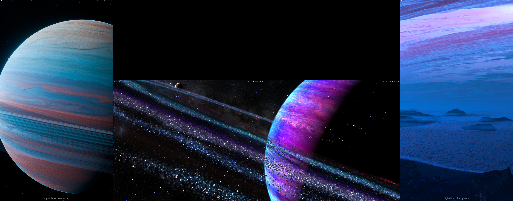
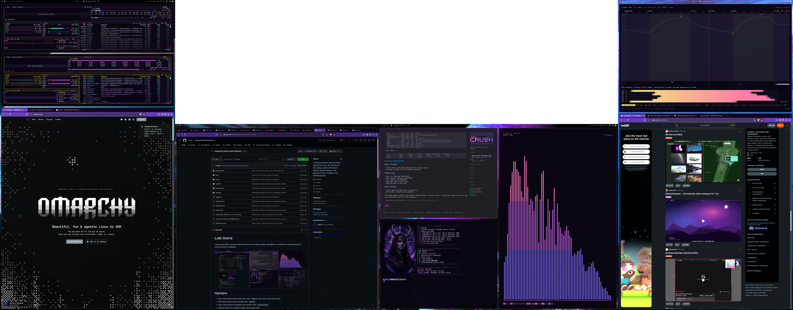

# Loki Zhadum

A dark purple-black Omarchy theme with Loki Zhadum branding, derived from the
original Osiris palette and packaged as a safe theme-only repository for normal
Omarchy installation.


## Highlights

- Deep purple-black base palette with violet, magenta, pink, blue, and cyan accents
- Near-black purple primary background: `#090511`
- Static Osiris-inspired wallpaper still included under `backgrounds/`
- Optional shell menu styling through `shell.menu.toml`
- Optional CLIamp Classic LED companion theme with indigo, magenta, and pink spectrum tiers
- Optional Fastfetch Kitty image-logo preset with the Loki portrait
- Optional Bash Starship prompt companion preset
- Designed for normal Omarchy theme installation and reuse across multiple machines

## Install

Install directly from GitHub:

```bash
omarchy theme install https://github.com/LokiX1/omarchy-loki-zhadum-theme.git
```

Then select the theme:

```bash
omarchy theme set loki-osiris
```

If your Omarchy version chooses a different installed directory name, list likely
theme names and use the one returned:

```bash
find ~/.config/omarchy/themes \
  -mindepth 1 -maxdepth 1 -type d \
  -printf '%f\n' | sort | grep -i 'loki\|osiris'
```

## Scope and safety

Loki Zhadum is deliberately a **theme-only** package. It changes the palette and
theme assets, but does not replace personal desktop behavior or install
executable customization.

It does **not** install or modify:

- Omarchy `shell.json`
- Hyprland `looknfeel.lua`
- Application-menu placement
- Quickbar or QuickShell plugins
- Super+Space keybindings
- User startup hooks
- `mpvpaper` or a live wallpaper startup configuration
- Existing Fastfetch or Starship configurations automatically

This makes the theme safe to install without replacing the standard centered
Omarchy menu or other personal shell customizations.

## ZHADUM branding

The repository includes canonical ZHADUM ASCII art for the Omarchy screensaver:

```text
branding/screensaver.txt
```

Install it manually after installing the theme:

```bash
install -Dm644 \
  ~/.config/omarchy/themes/loki-osiris/branding/screensaver.txt \
  ~/.config/omarchy/branding/screensaver.txt
```


An optional Plymouth boot/unlock glitch-reveal generator is also included:

```text
scripts/zhadum-plymouth-glitch
```

It is deliberately opt-in because it changes the system boot theme, writes under
`/usr/share`, and rebuilds the initramfs. Review and preview it before running:

```bash
cd ~/.config/omarchy/themes/loki-osiris
STAGE_ONLY=1 KEEP_STAGE=1 ./scripts/zhadum-plymouth-glitch
```

See [`docs/BOOT-BRANDING.md`](docs/BOOT-BRANDING.md) for screensaver setup,
safe preview, installation, requirements, and restoration instructions.

## Wallpaper

The repository includes a static still image:

```text
backgrounds/osiris-live-still.png
```

See [`backgrounds/CREDITS.md`](backgrounds/CREDITS.md) for attribution details.

The repository does not include the original video wallpaper or activate a
live-wallpaper hook.

## Customization

The core palette is defined in [`colors.toml`](colors.toml).

```toml
background = "#090511"
dark_background = "#09031a"
darker_background = "#05020f"
lighter_background = "#2a1050"

accent = "#9b2ecd"
magenta = "#c060e0"
bright_magenta = "#d8ace8"
```

Change `background` to adjust the overall darkness, then reapply the theme:

```bash
omarchy theme set loki-osiris
```

## CLIamp companion theme

An optional CLIamp companion theme for the **Classic LED** visualizer is
included:

```text
extras/cliamp/loki-osiris-led.toml
```

Install it manually:

```bash
mkdir -p ~/.config/cliamp/themes

cp \
  ~/.config/omarchy/themes/loki-osiris/extras/cliamp/loki-osiris-led.toml \
  ~/.config/cliamp/themes/
```

Start CLIamp, play audio, press `t`, select `loki-osiris-led`, and press Enter.

The Classic LED visualizer maps:

```text
Lower spectrum  → indigo-violet
Middle spectrum → Osiris magenta
Peaks           → bright pink
```

See [`docs/CLIAMP.md`](docs/CLIAMP.md) for companion-theme details.

## Fastfetch companion preset

An optional Fastfetch configuration and portrait asset are included:

```text
fastfetch/loki-osiris.jsonc
fastfetch/images/loki-osiris.png
```


The preset is designed for Kitty image rendering. Preview it without replacing
your existing Fastfetch configuration:

```bash
fastfetch --config \
  ~/.config/omarchy/themes/loki-osiris/fastfetch/loki-osiris.jsonc
```

To use it as your default Fastfetch configuration:

```bash
mkdir -p ~/.config/fastfetch/images

cp \
  ~/.config/omarchy/themes/loki-osiris/fastfetch/images/loki-osiris.png \
  ~/.config/fastfetch/images/loki-osiris.png

cp \
  ~/.config/omarchy/themes/loki-osiris/fastfetch/loki-osiris.jsonc \
  ~/.config/fastfetch/config.jsonc
```

The bundled portrait layout uses an image width of 41 columns, a height of 29
rows, and padding of 1 top row plus 2 columns on each side. See
[`docs/FASTFETCH.md`](docs/FASTFETCH.md) for details.

## Starship companion preset

An optional Starship prompt configuration for Bash is included:

```text
starship/loki-osiris.toml
```

Preview it in a temporary Bash shell:

```bash
STARSHIP_CONFIG=~/.config/omarchy/themes/loki-osiris/starship/loki-osiris.toml \
  bash --noprofile --rcfile ~/.bashrc -i
```

To make it your default Starship configuration, back up and replace the normal
Starship config:

```bash
cp -av \
  ~/.config/starship.toml \
  ~/.config/starship.toml.before-loki-osiris

cp \
  ~/.config/omarchy/themes/loki-osiris/starship/loki-osiris.toml \
  ~/.config/starship.toml
```

See [`docs/STARSHIP.md`](docs/STARSHIP.md) for temporary and persistent
`STARSHIP_CONFIG` override options.


## Hyprland opacity companion

Loki Osiris includes an optional Hyprland rule snippet for a subtle
inactive-window fade:

```text
extras/hypr/loki-osiris-opacity.lua
```

The snippet matches the Loki Osiris desktop preference:

- Focused normal windows: 1.00 opacity
- Inactive normal windows: 0.98 opacity
- Inactive Chromium- and Firefox-family browsers: 0.98 opacity
- Video-playing windows: 1.00 opacity

Omarchy 4.0.3 defines its default opacity rules outside the theme-template
system, so this setting is intentionally **not applied automatically** by
`omarchy theme install`. It is supplied as a small, reviewable companion
snippet rather than replacing your personal
`~/.config/hypr/looknfeel.lua`.

See [`docs/HYPRLAND-OPACITY.md`](docs/HYPRLAND-OPACITY.md) for the safe
installation procedure.

## Three-monitor wallpapers

Loki Osiris includes an optional static Hyprpaper profile for a tested
three-monitor layout:

```text
DP-2  Left portrait display   → Caelum
DP-1  Center ultrawide        → Roche
DP-3  Right portrait display  → Outland
```





The first preview shows the three wallpapers without applications covering them.
The second shows the same setup in active desktop use.

The profile is intentionally opt-in because monitor connector names and display
layouts vary between systems. It does not run automatically when the theme is
installed or selected.

See [`docs/THREE-MONITOR-WALLPAPERS.md`](docs/THREE-MONITOR-WALLPAPERS.md) for
installation, monitor-name checks, Hyprpaper setup, and compatibility notes.

## Update

After pushing changes to this repository, update a previously installed Git
theme with:

```bash
omarchy theme update
omarchy theme set loki-osiris
```

Reapplying the theme refreshes Omarchy-generated color-dependent application
settings.

## Credits

The theme palette is based on the Osiris aesthetic and adapted for a
theme-only Omarchy workflow. Wallpaper attribution is documented in
[`backgrounds/CREDITS.md`](backgrounds/CREDITS.md).
