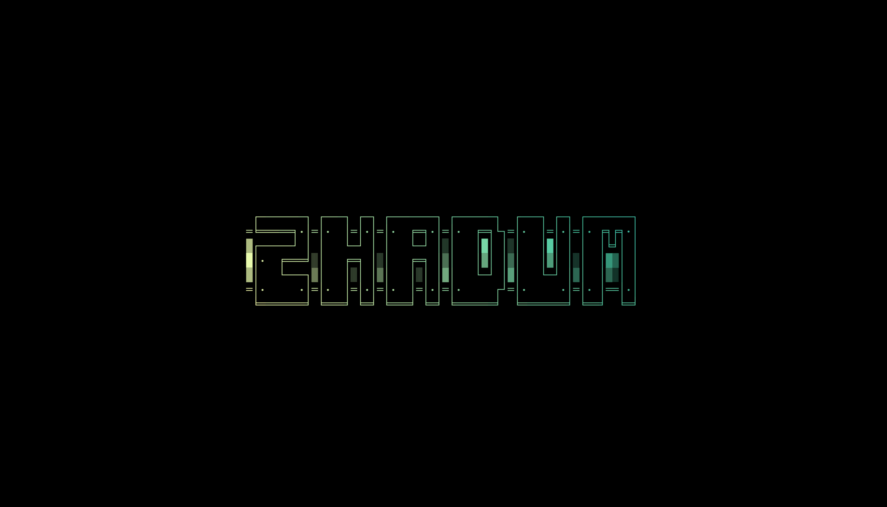

# ZHADUM screensaver and boot branding

Loki Zhadum provides the source art for two separate visual surfaces:

- **Screensaver:** animated terminal-style ASCII art.
- **Boot unlock:** a Plymouth glitch-reveal generated from the same ASCII art.



## Screensaver

The canonical screensaver source is:

```text
branding/screensaver.txt
```

Install it into the active Omarchy branding directory:

```bash
install -Dm644 \
  branding/screensaver.txt \
  ~/.config/omarchy/branding/screensaver.txt
```

Preview it through:

```text
Super + Space → Style → Screensaver
```

The screensaver uses text effects to animate this static ASCII source.

## Boot unlock

The optional boot-unlock theme is generated by:

```text
scripts/zhadum-plymouth-glitch
```

It renders the ASCII art into a sequence of glitch/decrypt frames, installs a separate Plymouth theme named `zhadum`, selects it as the default theme, and rebuilds the initramfs.

This is intentionally not run automatically by Omarchy theme installation. It writes under `/usr/share`, changes the boot theme, and invokes `sudo`.

### Requirements

- `plymouth`
- ImageMagick (`magick` and `identify`)
- JetBrains Mono Nerd Font at:

  ```text
  /usr/share/fonts/TTF/JetBrainsMonoNerdFont-Regular.ttf
  ```

- `limine-mkinitcpio` or standard `mkinitcpio`

### Preview safely

From the repository root, render into a temporary directory without privileged writes:

```bash
STAGE_ONLY=1 KEEP_STAGE=1 \
  ./scripts/zhadum-plymouth-glitch
```

The command prints a staging directory. Inspect the final clear frame:

```bash
xdg-open /tmp/zhadum-plymouth-stage.XXXXXX/frame-019.png
```

Inspect the eye backdrop if desired:

```bash
xdg-open /tmp/zhadum-plymouth-stage.XXXXXX/eye.png
```

Delete the temporary stage directory when finished:

```bash
rm -rf /tmp/zhadum-plymouth-stage.XXXXXX
```

### Install

After reviewing the staged output:

```bash
./scripts/zhadum-plymouth-glitch
```

The script requests sudo access only for the final installation stage. It installs generated assets to:

```text
/usr/share/plymouth/themes/zhadum
```

Then it selects `zhadum` as the default Plymouth theme and rebuilds the initramfs. Reboot to see the result.

## Restore OSIRIS

The ZHADUM generator does not remove the existing `osiris` theme. Restore it with:

```bash
sudo plymouth-set-default-theme osiris

if command -v omarchy-cmd-present >/dev/null &&
  omarchy-cmd-present limine-mkinitcpio; then
  sudo limine-mkinitcpio
else
  sudo mkinitcpio -P
fi
```
